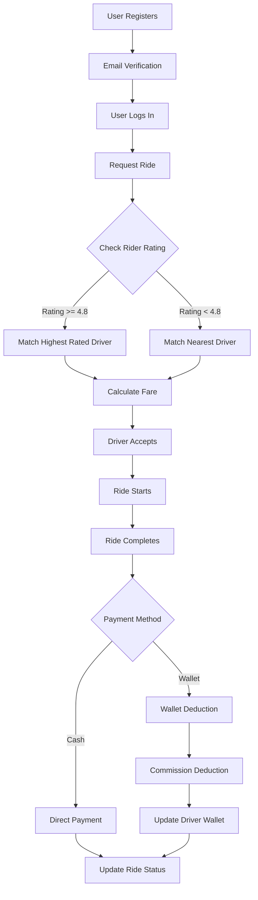

# 🚗 QuickCab - Ride Hailing Platform

[](https://spring.io/projects/spring-boot)
[](https://www.oracle.com/java/)
[](https://www.postgresql.org/)

> A production-ready ride-hailing platform built with Spring Boot, featuring dynamic fare calculation, intelligent driver matching, and secure payment processing.

## 📋 Table of Contents

- [Overview](#-overview)
- [Key Features](#-key-features)
- [Architecture](#-architecture)
- [Technical Stack](#-technical-stack)
- [Getting Started](#-getting-started)
- [API Documentation](#-api-documentation)
- [Design Patterns](#-design-patterns)
- [Roadmap](#-roadmap)
- [Contributing](#-contributing)
- [Contact](#-contact)

## 🎯 Overview

QuickCab is a comprehensive ride-hailing application that replicates core functionalities of platforms like Uber. Built with Spring Boot and following industry best practices, it demonstrates a scalable, modular architecture suitable for production environments.

### What Makes QuickCab Special?

- **Smart Driver Matching**: Dynamically selects drivers based on ratings and proximity
- **Flexible Payment System**: Supports both cash and wallet-based transactions
- **Real-time Fare Calculation**: Implements surge pricing and distance-based fares using OSRM
- **Secure Authentication**: JWT-based security with email verification
- **Transaction Transparency**: Complete wallet transaction history for users and drivers

## ✨ Key Features

### 🔐 Authentication & Security
- Separate authentication flows for riders and drivers
- JWT-based secure token management
- Email verification via Gmail SMTP
- Password reset functionality

### 🚕 Ride Management
- **Ride Lifecycle**: REQUESTED → ACCEPTED → ONGOING → COMPLETED
- Real-time ride status updates
- Driver acceptance/rejection mechanism
- Ride history tracking

### 🎯 Intelligent Driver Matching

Implements Strategy Pattern for flexible driver selection:

| Strategy | Description | Use Case |
|----------|-------------|----------|
| **Nearest Driver** | Matches closest available driver | Standard rides (rating < 4.8) |
| **Highest Rated** | Prioritizes top-rated drivers | Premium rides (rating ≥ 4.8) |

### 💰 Dynamic Fare Calculation

- **Base Fare**: ₹10 per kilometer
- **Surge Pricing**: Active between 6 PM - 9 PM
- **OSRM Integration**: Accurate distance and duration calculation
- Real-world route mapping

### 💳 Payment Processing
```java
// Flexible payment strategies
├── CashPaymentStrategy      → Direct rider-to-driver payment
└── WalletPaymentStrategy    → In-app wallet with 30% platform commission
```

### 💼 Wallet System
- Dedicated wallets for riders and drivers
- Complete transaction history
- Automatic commission deduction
- Balance management and top-up support

### 🗺️ Geospatial Features
- PostGIS integration for spatial queries
- JTS (Java Topology Suite) for coordinate handling
- Efficient nearest driver calculation
- Distance-based fare computation

## 🏗️ Architecture

### Project Structure
```
com.codingshuttle.project.uber.uberApp
│
├── 📁 controllers/          # REST API endpoints
│   ├── AuthController
│   ├── RideController
│   └── PaymentController
│
├── 📁 dto/                  # Data Transfer Objects
│   ├── RideRequestDto
│   ├── UserDto
│   └── PointDto
│
├── 📁 entities/             # JPA Entities
│   ├── User
│   ├── Driver
│   ├── Ride
│   └── Wallet
│
├── 📁 repositories/         # Spring Data JPA Repositories
│   ├── UserRepository
│   ├── RideRepository
│   └── WalletRepository
│
├── 📁 services/             # Business Logic
│   ├── impl/
│   ├── RideService
│   ├── PaymentService
│   └── WalletTransactionService
│
├── 📁 strategies/           # Strategy Pattern Implementations
│   ├── impl/
│   ├── DriverMatchingStrategy
│   ├── RideFareCalculationStrategy
│   └── PaymentStrategy
│
├── 📁 utils/                # Utility Classes
│   └── GeometryUtil
│
├── 📁 config/               # Configuration Classes
│   ├── SecurityConfig
│   └── MapperConfig
│
└── 📄 UberAppApplication.java
```

### Strategy Pattern Implementation
```java
@Service
public class DriverMatchingStrategyManager {
    
    @Autowired
    private NearestDriverStrategy nearestDriverStrategy;
    
    @Autowired
    private HighestRatedDriverStrategy highestRatedDriverStrategy;
    
    public DriverMatchingStrategy getStrategy(double riderRating) {
        return riderRating >= 4.8 
            ? highestRatedDriverStrategy 
            : nearestDriverStrategy;
    }
}
```

### GeometryUtil Example
```java
public class GeometryUtil {
    
    private static final GeometryFactory geometryFactory = 
        new GeometryFactory(new PrecisionModel(), 4326);
    
    public static Point createPoint(PointDto pointDto) {
        Coordinate coordinate = new Coordinate(
            pointDto.getCoordinates()[0], 
            pointDto.getCoordinates()[1]
        );
        return geometryFactory.createPoint(coordinate);
    }
    
    public static double calculateDistance(Point point1, Point point2) {
        return point1.distance(point2) * 111.32; // Convert to kilometers
    }
}
```

## 🛠️ Technical Stack

| Layer | Technology | Purpose |
|-------|-----------|---------|
| **Backend** | Spring Boot 3.x | Application framework |
| **Security** | Spring Security + JWT | Authentication & Authorization |
| **ORM** | Hibernate/JPA | Object-relational mapping |
| **Database** | PostgreSQL + PostGIS | Data persistence + Geospatial queries |
| **Email** | Gmail SMTP | Email notifications |
| **Mapping** | ModelMapper | DTO ↔ Entity conversion |
| **Routing** | OSRM API | Route calculation & distance |
| **Location Services** | OSRM API | Real-time location tracking & routing |
| **Build Tool** | Maven | Dependency management |

## 🚀 Getting Started

### Prerequisites

- **Java**: JDK 17 or higher
- **Maven**: 3.6+
- **PostgreSQL**: 13+ with PostGIS extension
- **SMTP Credentials**: Gmail account with app password

### Installation

1. **Clone the repository**
```bash
   git clone https://github.com/yourusername/quickcab.git
   cd quickcab
```

2. **Set up PostgreSQL**
```sql
   CREATE DATABASE quickcab_db;
   CREATE EXTENSION postgis;
```

3. **Configure application.properties**
```properties
   # Database Configuration
   spring.datasource.url=jdbc:postgresql://localhost:5432/quickcab_db
   spring.datasource.username=your_username
   spring.datasource.password=your_password
   
   # JPA Configuration
   spring.jpa.hibernate.ddl-auto=update
   spring.jpa.show-sql=true
   spring.jpa.properties.hibernate.format_sql=true
   spring.jpa.properties.hibernate.dialect=org.hibernate.spatial.dialect.postgis.PostgisDialect
   
   # Email Configuration
   spring.mail.username=your_email@gmail.com
   spring.mail.password=your_app_password
   spring.mail.host=smtp.gmail.com
   spring.mail.port=587
   spring.mail.properties.mail.smtp.auth=true
   spring.mail.properties.mail.smtp.starttls.enable=true
   
   # JWT Configuration
   jwt.secretKey=your_secret_key_here_minimum_256_bits
   jwt.expiration=86400000
```

4. **Build the project**
```bash
   mvn clean install
```

5. **Run the application**
```bash
   mvn spring-boot:run
```

6. **Access the application**
   - API Base URL: `http://localhost:8080`
   - API Documentation: `http://localhost:8080/swagger-ui.html` (if Swagger is configured)

## 📚 API Documentation

### Authentication Endpoints

| Method | Endpoint | Description | Auth Required |
|--------|----------|-------------|---------------|
| POST | `/api/auth/register` | Register new user/driver | ❌ |
| POST | `/api/auth/login` | Authenticate user | ❌ |
| POST | `/api/auth/verify-email` | Verify email address | ❌ |
| POST | `/api/auth/reset-password` | Reset forgotten password | ❌ |

### Ride Endpoints

| Method | Endpoint | Description | Auth Required |
|--------|----------|-------------|---------------|
| POST | `/api/rides/request` | Request a new ride | ✅ |
| GET | `/api/rides/{id}` | Get ride details | ✅ |
| POST | `/api/rides/{id}/accept` | Driver accepts ride | ✅ |
| POST | `/api/rides/{id}/start` | Start the ride | ✅ |
| POST | `/api/rides/{id}/complete` | Complete the ride | ✅ |
| GET | `/api/rides/history` | Get ride history | ✅ |

### Payment Endpoints

| Method | Endpoint | Description | Auth Required |
|--------|----------|-------------|---------------|
| POST | `/api/payment/process` | Process ride payment | ✅ |
| GET | `/api/wallet/balance` | Get wallet balance | ✅ |
| POST | `/api/wallet/topup` | Add funds to wallet | ✅ |
| GET | `/api/wallet/transactions` | Get transaction history | ✅ |

### Sample Request/Response

**POST /api/rides/request**
```json
{
  "pickupLocation": {
    "coordinates": [85.8245, 20.2961]
  },
  "dropoffLocation": {
    "coordinates": [85.8350, 20.3010]
  },
  "rideType": "STANDARD"
}
```

**Response**
```json
{
  "rideId": "123e4567-e89b-12d3-a456-426614174000",
  "status": "REQUESTED",
  "estimatedFare": 150.00,
  "estimatedDistance": 5.2,
  "estimatedDuration": 15,
  "driver": null
}
```

## 🎨 Design Patterns

### 1. Strategy Pattern
Used for implementing flexible business logic:
- **Driver Matching**: Select drivers based on different criteria
- **Fare Calculation**: Apply different pricing strategies
- **Payment Processing**: Support multiple payment methods

### 2. Repository Pattern
- Abstracts data access layer
- Provides clean separation of concerns
- Enables easy testing and maintainability

### 3. DTO Pattern
- Encapsulates data transfer between layers
- Prevents exposure of internal entities
- Enables versioning and backward compatibility

### 4. Dependency Injection
- Constructor-based injection for required dependencies
- Loose coupling between components
- Facilitates unit testing

### 5. Builder Pattern
- Used in entity creation (e.g., Ride, User)
- Provides fluent API for object construction

## 🔄 Application Flow


## 🗺️ Roadmap

### Phase 1 - Current ✅
- [x] User and Driver authentication
- [x] Ride request and acceptance
- [x] Dynamic fare calculation
- [x] Payment processing
- [x] Wallet system

### Phase 2 - In Progress 🚧
- [ ] Real-time ride tracking with WebSockets
- [ ] Push notifications
- [ ] Rating and review system
- [ ] Admin dashboard

### Phase 3 - Planned 📋
- [ ] Google Maps API integration
- [ ] Ride scheduling
- [ ] Surge zone visualization
- [ ] Driver incentive programs
- [ ] Ride sharing (carpool)
- [ ] Multi-language support
- [ ] Mobile app integration

### Phase 4 - Future 🔮
- [ ] Machine learning for demand prediction
- [ ] Fraud detection system
- [ ] Carbon footprint tracking
- [ ] Subscription plans
- [ ] Corporate account management

## 🤝 Contributing

Contributions are welcome! Please follow these steps:

1. Fork the repository
2. Create a feature branch (`git checkout -b feature/AmazingFeature`)
3. Commit your changes (`git commit -m 'Add some AmazingFeature'`)
4. Push to the branch (`git push origin feature/AmazingFeature`)
5. Open a Pull Request

### Coding Standards
- Follow Java naming conventions
- Write unit tests for new features
- Update documentation as needed
- Use meaningful commit messages


## 👤 Author

**Abhishek Anand**

- Fourth-year Computer Science and Engineering student
- Passionate about scalable backend systems and software architecture
- GitHub: [@yourusername](https://github.com/Abhishekanand1185)
- LinkedIn: [Your LinkedIn](https://www.linkedin.com/in/abhishekanand1065)
- Email: abhishekanand1185@gmail.com

## 🙏 Acknowledgments

- [Spring Boot Documentation](https://spring.io/projects/spring-boot)
- [Hibernate ORM](https://hibernate.org/)
- [PostgreSQL](https://www.postgresql.org/)
- [OSRM Project](http://project-osrm.org/)

## 📞 Support

If you encounter any issues or have questions:

1. Create a new issue with detailed information
2. Contact me via email

---

<div align="center">

**⭐ If you found this project helpful, please consider giving it a star!**

Made with ❤️ by Abhishek Anand

</div>
